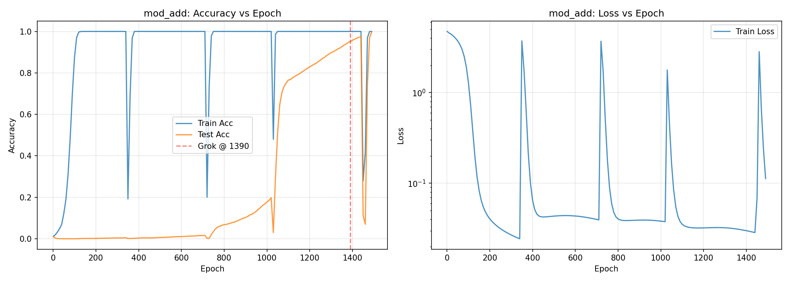
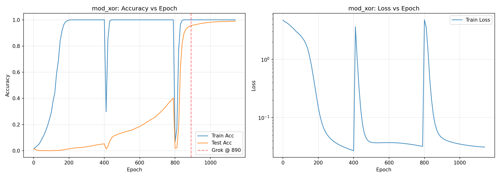

# Computational Limitations and Capabilities of Transformer Architectures for Cryptographic Operations

**Josue Peláez** (kotarods) · Independent Researcher, 17 · April 2026

---

## Abstract

We benchmarked 50 LLMs on individual SHA-256 operations and found 0% accuracy on bitwise ops (XOR, AND, rotation) across all models except GPT-5.4 Pro (10% XOR). We then trained a minimal 2-layer transformer from scratch and demonstrated via grokking that XOR is learnable — reaching 99% accuracy in 890 epochs (7 minutes, CPU only). Unexpectedly, XOR was learned faster than modular addition (890 vs 1,390 epochs), suggesting bitwise operations may have more accessible internal structure than previously assumed.

## Key Results

### Phase 1: 50 LLMs tested on SHA-256 individual operations

Every model was given 10 questions per operation (modular addition, XOR, AND, bit rotation, bit shift) using actual 32-bit values from SHA-256.

| Model | ADD% | XOR% | AND% | ROTR% | SHR% | AVG% |
|---|---|---|---|---|---|---|
| gpt-4o | 100% | 0% | 0% | 0% | 0% | 20% |
| GPT-5.4 Pro | 80% | **10%** | 0% | 0% | 0% | 18% |
| Gemini 3 Flash | 80% | 0% | 0% | 0% | 0% | 16% |
| Gemini 3.1 Flash Lite | 60% | 0% | 0% | 0% | 0% | 12% |
| GPT-5.4 | 50% | 0% | 0% | 0% | 0% | 10% |
| Kimi K2 | 50% | 0% | 0% | 0% | 0% | 10% |
| Gemini 2.5 Pro | 40% | 0% | 0% | 0% | 0% | 8% |
| Qwen3 235B | 40% | 0% | 0% | 0% | 0% | 8% |
| ... (50 models total) | | | | | | |
| 30+ models | 0% | 0% | 0% | 0% | 0% | 0% |

**Key finding:** Only 1 of 50 models (GPT-5.4 Pro) got any XOR question right. Zero models solved AND, rotation, or shift. Modular addition is partially learnable from pretraining, but bitwise operations are not.

### Phase 2: Grokking — Training a transformer to learn XOR

| Task | Grokking epoch | Test accuracy | Training time (CPU) |
|---|---|---|---|
| Modular addition (a+b) mod 97 | 1,390 | 99.7% | 9 min |
| XOR (a^b) mod 97 | **890** | **99.0%** | **7 min** |

Model: 2 layers, 1 attention head, 128 dims, 431,616 parameters. Ryzen 7 5700U, no GPU.




Both show classic grokking: train accuracy hits 100% early, test accuracy stays near 0% for hundreds of epochs, then jumps to 99%+.

### Operation mapping: Transformer vs SHA-256

| Metric | Value |
|---|---|
| GPT-2 FLOPs per token | 170,252,350 |
| SHA-256 ops per block | 2,296 |
| SHA-256 ops with no native transformer equivalent | 4 of 6 (XOR, ROTR, SHR, NOT) |
| Cost to simulate 1 XOR in float32 | ~96 ops |
| SHA-256 that fit in 1 forward pass (by time) | ~67,843 |

## Significance

This is the first benchmark of individual SHA-256 operations across 50 LLMs. The finding that XOR grokks faster than modular addition is unexpected — bitwise operations, despite having no native float32 equivalent, may encode more learnable structure than standard modular arithmetic. The 0% accuracy across 50 models on bitwise ops establishes a clear boundary of what pretrained LLMs cannot compute — a boundary that targeted training can cross.

## Reproduce

```bash
# Phase 1: Map transformer operations
python3 phase1/transformer/mapear_transformer.py

# Phase 1: Decompose SHA-256
python3 phase1/sha256/descomponer_sha256.py

# Phase 1: Benchmark
gcc -O3 -march=native -o sha256_bench phase1/benchmark/sha256_bench.c -lcrypto
python3 phase1/benchmark/velocidad.py

# Phase 1: Run LLM benchmark (requires API keys)
# Set GROQ_API_KEY, GEMINI_API_KEY, OPENAI_API_KEY, etc.
python3 phase1/aritmetica/benchmark_modelos.py

# Phase 2: Train grokking model
python3 phase2/grokking/generar_dataset.py
python3 phase2/grokking/entrenar.py
python3 phase2/grokking/benchmark_velocidad.py
```

Requirements: Python 3.12+, PyTorch 2.x, transformers, matplotlib. CPU is sufficient.

## Next Steps

- **Phase 3:** Scale XOR learning from mod 97 to 8-bit, 16-bit, and 32-bit operands.
- **Phase 4:** Chain multiple operations to simulate a complete SHA-256 round.
- **Phase 5:** Compare with specialized arithmetic circuits (NALU, NAC).

## License

MIT
